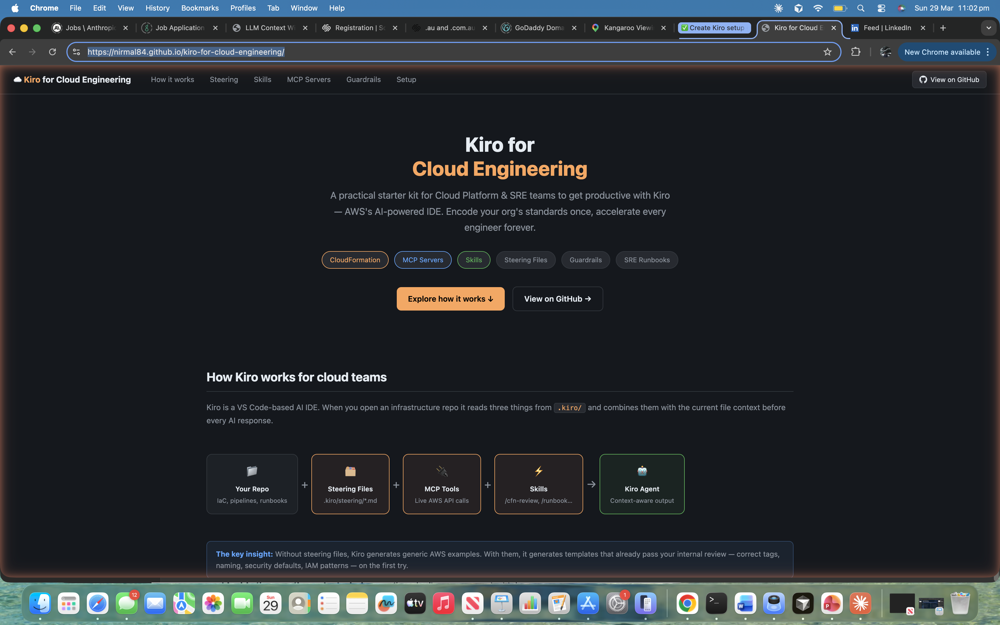

# Kiro for Cloud Platform & SRE Teams

A practical guide and starter kit for Cloud Platform Engineers and SREs to get productive with [Kiro](https://kiro.dev) — AWS's AI-powered IDE — for day-to-day infrastructure and operations work.

**[🌐 Live Interactive Guide →](https://nirmal84.github.io/kiro-for-cloud-engineering/)**



## What this repo gives you

| Section | What's inside |
|---|---|
| [Getting Started](./getting-started/) | Step-by-step setup from fresh Kiro install to first AI-assisted deployment |
| [Steering Files](./steering/) | Ready-to-use steering templates for CloudFormation, platform guardrails, SRE runbooks |
| [Guardrails](./guardrails/) | Central guardrails for AWS account access, deployment gates, IAM boundaries |
| [MCP Servers](./mcp-servers/) | Recommended MCP servers and configuration for AWS-native workflows |
| [Skills](./skills/) | Reusable Kiro skills for CFN linting, cost estimation, incident response |
| [Examples](./examples/) | Worked examples using all of the above together |

## Who this is for

- **Cloud Platform Engineers** building and maintaining AWS account vending, networking, and shared services
- **SREs** managing production systems, on-call runbooks, and reliability automation
- **DevOps/IaC engineers** writing CloudFormation, CDK, or Terraform day-to-day

## Core concept: how Kiro accelerates cloud work

```
Your repo
  └── .kiro/
        ├── steering/          ← Tell Kiro how YOUR org does things
        │     ├── aws-standards.md
        │     ├── cfn-patterns.md
        │     └── tagging-policy.md
        ├── hooks/             ← Automate on file save, pre-commit, etc.
        └── settings.json      ← MCP servers, skills, preferences
```

Steering files are the multiplier. They encode your org's standards once, then every engineer using Kiro gets those standards applied automatically — no copy-paste, no code review reminders.

## Quick start (5 minutes)

```bash
# 1. Clone this repo
git clone <this-repo-url> kiro-cloud-starter
cd kiro-cloud-starter

# 2. Copy the .kiro config into your infrastructure repo
cp -r .kiro /path/to/your/infra-repo/

# 3. Open your infra repo in Kiro
# File > Open Folder > /path/to/your/infra-repo

# 4. Kiro auto-loads steering files from .kiro/steering/
# Start chatting: "Generate a VPC with 3-tier subnets for prod"
```

## Recommended learning path

1. [01 - Install Kiro and open your first project](./getting-started/01-install-and-setup.md)
2. [02 - Understand steering files](./getting-started/02-steering-files-guide.md)
3. [03 - Set up CloudFormation steering](./getting-started/03-cloudformation-steering.md)
4. [04 - Configure MCP servers](./getting-started/04-mcp-servers-setup.md)
5. [05 - Build central guardrails](./getting-started/05-central-guardrails.md)
6. [06 - Create your first skill](./getting-started/06-skills-guide.md)
